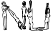

Starter boilerplate for Gulp

__Includes:__
  * LiveReload
  * Browserify
  * Javascript
  * Javascript ES6
  * CoffeeScript
  * PullDown
  * CSS
  * Stylus
  * HTML
  * Jade
  * React/JSX

__Setup:__

` make s`

__Watch:__

` make s`
  
  > Open http://localhost:8000

__Build:__

` make b`

__Install client-side libs:__
  > It uses PullDown to download the libs from CDNJS.

`make i l jquery`

__Config:__

You can change some config options at `build/config.json`

__Structure:__

````bash
nakedapp
├── README.md
├── package.json
├── Makefile
├── LICENSE
├── public
│   ├── img
│   ├── scripts
│   ├───├── app.js
│       └── vendors.js
│── src
│    ├── app
│    │   ├── app.coffee
│    │   ├── lib
│    │   ├── models
│    │   └── views
│    ├── styles
│    │   └── app.styl
│    └── templates
│        └── app.jade
└── build
    ├── tasks
    │   ├── browserify.js
    │   ├── clean.js
    │   ├── images.js
    │   ├── scripts.js
    │   ├── server.js
    │   ├── styles.js
    │   └── watch.js
    ├── util
    │   ├── bundleLogger.js
    │   └── handleErrors.js
    ├── config.json
    └── gulpfile.json
````

>>>>>>> d5ca9122f27880160251e2d5067b1a98bad8a274
